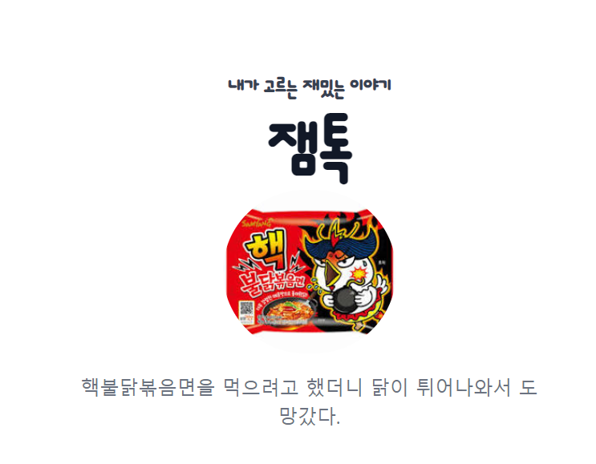
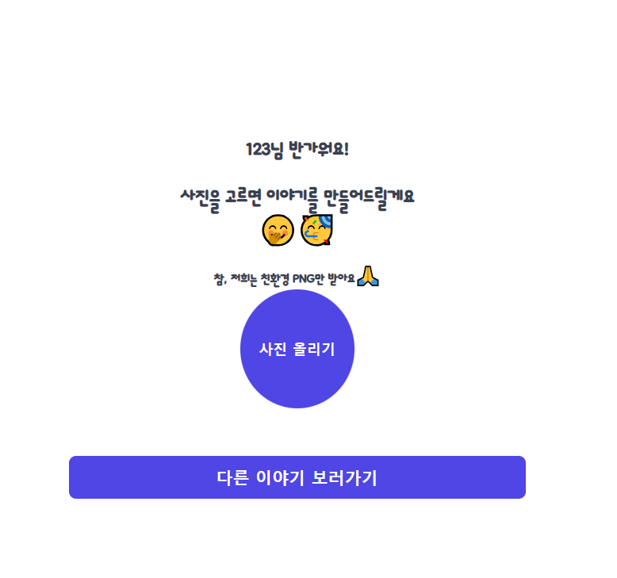
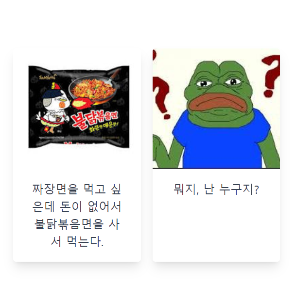

# 프로젝트 소개
 
모든 개그는 자고로 우연에서 오는 것이다. 
재민씨 피티군의 만남, 그리고 재미까지 선물하는 잼톡
# 기획 참고 모델 
한창 인기를 끌었던 고독한 명수방과 갈틱폰에서 출발한 아이디어 
그런데요 사람이 아닌 두 인공지능의 만남
# 사용된 기술적 부분
## 형상관리

- [x] 디스코드로 형상관리를 한다? 열정만 있으면 무엇이든 OK인 이곳은 정글입니다.  

- [X] 우리는 개발자다. 그렇기에 모든 최종은 과감하게 git-hub의 main에서 관리합니다.

## 배포
aws를 사용하여 배포
## DB
몽고DB와 studio
# 팀원 소개

| 이름 | 깃허브 링크 | 
|:-----:|:-------------:|
| 김준혁 | [김준혁 깃헙](https://github.com/JunHyeokDev) |
| 박이나 | [박이나 깃헙](https://github.com/park-yina) |
| 이규홍 | [이규홍 깃헙](https://github.com/6puritans9) |

# ⏳개발 기간
- 단 100시간. 처음 본 사람들과 아이디어 교류 그리고 kdt 설명회에 수면까지 챙기며 실질적인 개발시간은... 
- 처음 리액트 생태계와 컴포넌트 분리 초반 설치 등을 하다 갑자기 들은 한마디 여러분들은 소잡는 칼로 닭🥠을 잡아요

# 실연모델
 
잼톡의 로그인 화면. 
🙏🏻저희는 친환경적인(?)프로그램을 지향하므로 png만 지원하겠습니다🙏🏻 
 
다른 이야기 예시들을 카드뷰로 구경할 수 있습니다.
# 아쉬웠던 부분-기술측면
- [] 아이디 찾기가 로컬에서만 돌아갔었음(이제는 과거형) 
